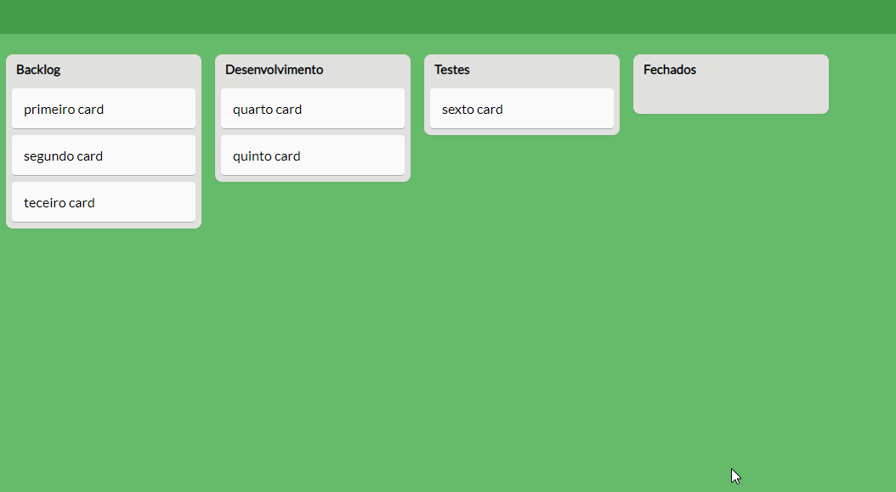

<h1 align="center">
Trello Vue Clone
</h1>

<p align="center">Clone de parte da interface e funcionalidades do Trello</p>

<p align="center">
  <a href="https://opensource.org/licenses/MIT">
    
  </a>
</p>

[//]: #

<div>
  <p align="center">
  
   </p>
</div>

<hr />

## Features

[//]: # 'Add the features of your project here:'

This app features all the latest tools and practices in web development!

- **Vue Js** — A JavaScript Framework for building user interfaces

## Getting started

```
yarn install
```

### Compiles and hot-reloads for development

```
yarn serve
```

### Compiles and minifies for production

```
yarn build
```

### Lints and fixes files

```
yarn lint
```

### Customize configuration

See [Configuration Reference](https://cli.vuejs.org/config/).

Made with ❤️ by Igor Tuag 👋🏽 [Keep in touch!](https://www.linkedin.com/in/igortuag/)
